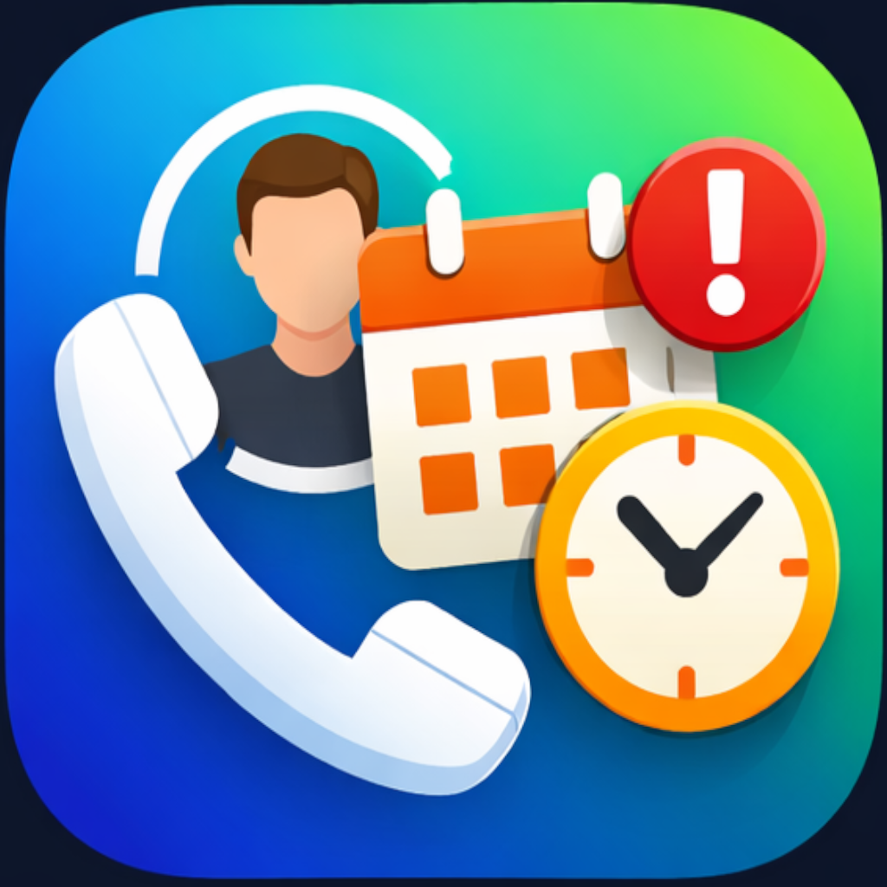

# Call Monitor 📞

[](https://flutter.dev/)
[](https://dart.dev/)

**Call Monitor** is a powerful Flutter application designed to help users track and monitor call logs for specific groups of contacts. Whether you're managing professional follow-ups or keeping track of family calls, Call Monitor provides a visual and organized way to stay on top of your communication.

<p align="center">
  
</p>

## ✨ Features

- **Track Groups:** Organize your contacts into groups for focused monitoring.
- **Visual Timeline:** View call history in a beautiful, easy-to-read timeline format.
- **Activity Heatmap:** Visualize call frequency and patterns over time with an integrated heatmap.
- **Background Monitoring:** Stay updated even when the app is closed, thanks to periodic background tasks.
- **Smart Notifications:** Receive timely notifications about call statuses and tracking updates.
- **Local Privacy:** All your data is stored securely on your device using a local SQLite database (Drift).

## 🚀 Getting Started

### Prerequisites

- [Flutter SDK](https://docs.flutter.dev/get-started/install) (>= 3.2.3)
- [Dart SDK](https://dart.dev/get-started/sdk)
- Android/iOS development environment

### Installation

1.  **Clone the repository:**
    ```bash
    git clone https://github.com/yourusername/call_monitor.git
    cd call_monitor
    ```

2.  **Install dependencies:**
    ```bash
    flutter pub get
    ```

3.  **Generate code (for Drift and other generators):**
    ```bash
    dart run build_runner build
    ```

4.  **Run the application:**
    ```bash
    flutter run
    ```

## 🛠️ Built With

- **Framework:** [Flutter](https://flutter.dev/)
- **State Management:** [Riverpod](https://riverpod.dev/)
- **Database:** [Drift](https://drift.simonbinder.eu/) (SQLite)
- **Background Tasks:** [Workmanager](https://pub.dev/packages/workmanager)
- **Notifications:** [Flutter Local Notifications](https://pub.dev/packages/flutter_local_notifications)
- **UI Components:** [Timeline Tile](https://pub.dev/packages/timeline_tile), [Flutter Heatmap Calendar](https://pub.dev/packages/flutter_heatmap_calendar)

## 📄 License

This project is licensed under the MIT License - see the [LICENSE](LICENSE) file for details (if applicable).
